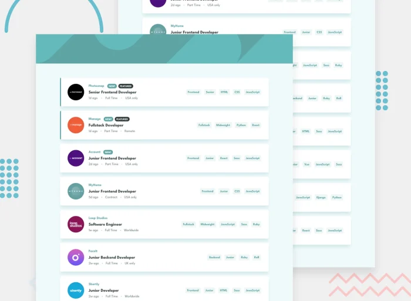
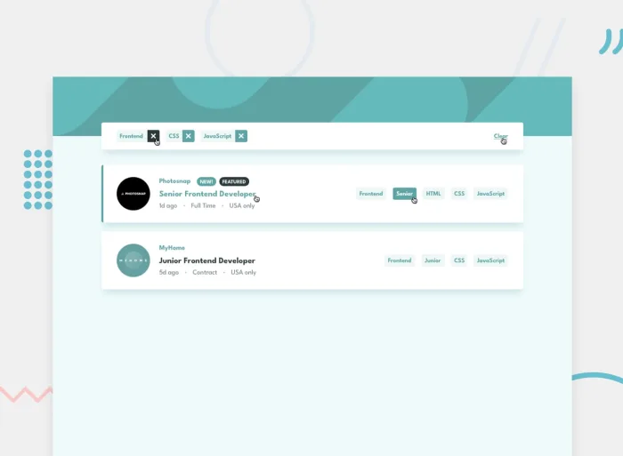

# Jobs

A web app that shows the job listing with feature to filter jobs.

## Data from

https://storage.googleapis.com/programiz-static/hiring/software/job-listing-page-challenge/data.json

## Usage

- `npm i`
- `npm run dev`

## Features

- shows the job listing 
- keyword in the gray boxes can be clicked to filter jobs with that keyword
- jobs can be filtered with multiple keywords